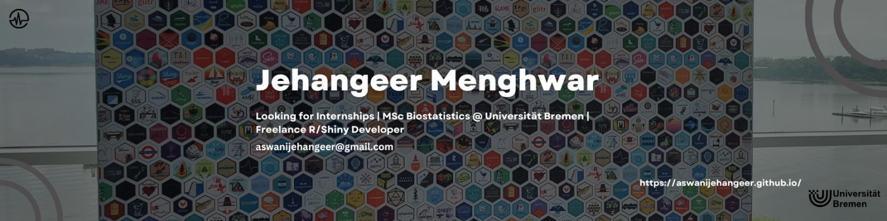

## I'm Jehangeer (Jango).

I am **seeking internships** or **freelance projects** in biostatistics and data analytics, focusing on **SAS**, **R**, and **Shiny development**, with an emphasis on **clinical trials** and **healthcare data**.

With a **bachelor’s degree** in **statistics** and over three years of **freelancing experience** as an **R Shiny developer**, I specialize in building custom web applications, interactive dashboards, and advanced data manipulation scripts in R.

Currently doing my **masters** in **Medical Biometry/Biostatistics** at the **University of Bremen**, I am focusing on statistical methods for clinical trials, which is enhancing my ability to analyze and interpret clinical study data.

Other than studies and work, I enjoy **playing chess** and **reading books**. In 2025, I have set a target to read at least **15 books** and to achieve a **2000** FIDE rating in chess.

 

## Projects
- [London Cycle Safe: A Semantic Shiny Dashboard](https://github.com/aswanijehangeer/LondonCycleSafe-A-Semantic-Shiny-Dashboard)
- [EU Sales Explorer: Dynamic Shiny Dashboard](https://github.com/aswanijehangeer/EU-Sales-Explorer-Shiny-Dashboard)
- [Chess Grandmasters Shiny App ♟️](https://github.com/aswanijehangeer/Chess-Grandmaster-Shiny-App)
- [Global Cereal Harvest Insights: Shiny App](https://github.com/aswanijehangeer/Global-Cereal-Harvest-Insights-Shiny-App)
- [Coffee Consumption Analysis: Shiny App](https://github.com/aswanijehangeer/Coffee-Consumption-Analysis-Shiny-App)

## Talks
- [Unveiling the Power of RShiny Dashboards](https://github.com/aswanijehangeer/Unveiling-the-Power-of-RShiny-Dashboards)

 

  <b>Let's connect and explore opportunities together.❤️</b>

