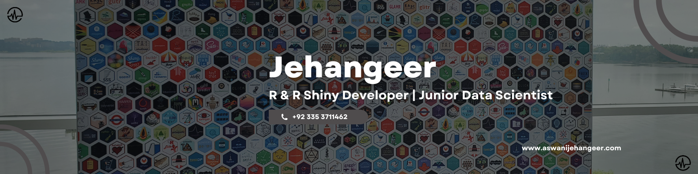

## Hi, I'm Jehangeer

I am a statistics graduate and a self-taught programmer who is passionate about using R and Shiny, enjoys playing chess, and loves reading books.

<!-- 

  

 -->

## What I am up to?

- Seeking a full-time role in data analytics focusing on R and Shiny development.
- Passionate about creating Shiny apps for insightful data exploration and visualizations.
- Experienced tutor in R Shiny, helping others unlock the power of interactive data applications.
- Freelancing on diverse data projects to broaden my expertise.
- Improving my chess skills and rating. ♟️
- 📫 Reach out to me through my [personal website](https://aswanijehangeer.com/).

 

 
  

  <b>Let's connect and explore opportunities together.❤️</b>

